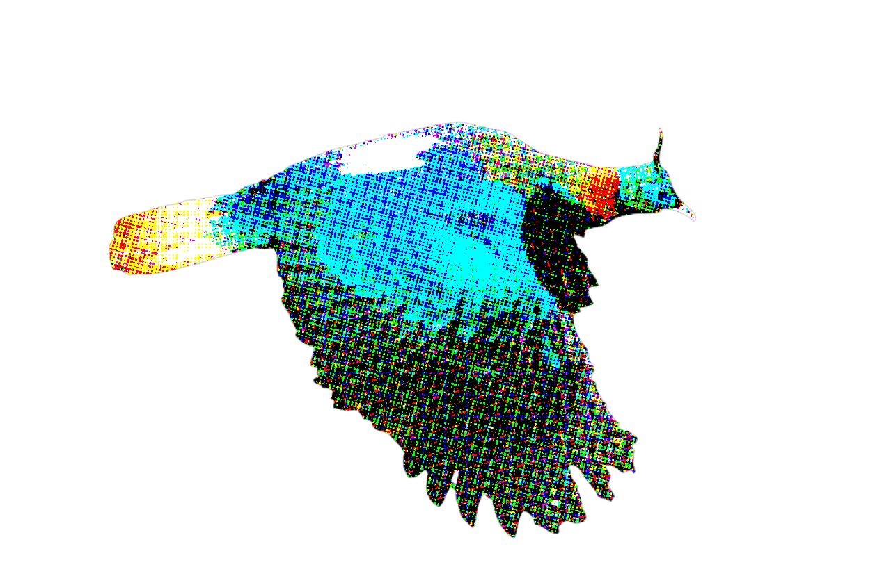
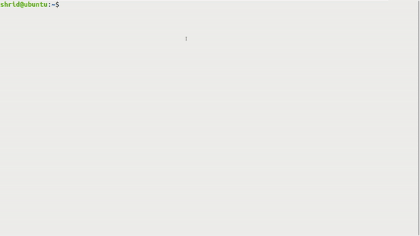

# danfe

     
    One stop solution to all your file transformation needs!

## Table of Contents

* [About the Project](#about-the-project)
* [Installation](#installation)
* [Execution](#execution)
    * [Standalone](#standalone)
    * [Plug and Play](#plug-and-play)
* [Examples](#examples)
* [Contrubuting](#contributing)
* [License](#license)
* [Contact](#contact)
* [Acknowledgements](#acknowledgements)

## About the Project

`danfe`, named after [डाँफे](http://dnpwc.gov.np/ne/species-detail/47/), is a simple tool that helps to convert files/data structures from one type to another.

## Installation

1. Execute `git clone https://github.com/shridpant/danfe`.
2. Add `danfe` to your PATH as follows:
    1. Temporary: Write `export PATH=$PATH:/path/to/danfe` to terminal.
    2. Permanent: Append `export PATH=$PATH:/path/to/danfe` to the end of your `~/.bashrc` file. Finally, type `source ~/.bashrc`.
3. And you're all set!  
==== EXTRA ====
4. _(Additionally)_ Please ensure that you have the necessary permissions on your OS before running the program. 
5. _(Additionally)_ Make `danfe` executable by running `chmod +x danfe` in the root directory of `danfe`.

**Note:** `danfe` requires Python 3 to run. No external dependencies are required, however.

## Execution

### Standalone 

The command-line interface is simple and powerful. Transform your files with simple commands and perform _get_ and/or _save_ operations to the output. 

**Usage:**

`danfe [-h] [--version] [-v] [-q] [-s LOCATION] -t {list,dict,json,csv} FILENAME`

_required arguments:_  
`FILENAME` _absolute or relative path to the argument file_ 
`-t {list,dict,json,csv}, --target {list,dict,json,csv}` _target file format or data structure to convert to_  
_optional arguments:_  
`-h, --help` _show this help message and exit_  
`--version` _show program's version number and exit_  
`-v, --verbose` _enable verbose_  
`-q, --quiet` _enable quiet mode_  
`-s LOCATION, --save LOCATION` _absolute or relative path to save the output_  

**Providing inputs and receiving outputs:**

* Inputs: In its present form, `danfe` can take _.json_, _.csv_ and _.ora_ files as inputs. Additionally, `danfe` is able to read some data structures (lists and dictionaries) provided as inputs through an extension-less file. Learn more about the inputs on the [wiki](https://github.com/shridpant/danfe/wiki/Inputs-&-Outputs).
* Outputs: By default, `danfe` only prints the output to the command-line; enfore the quiet mode to prevent this. Exercising the `-s LOCATION` option should allow the users to save the output _as any file type, to any location_. To save to the current location, just append `-s .` to your command. Learn more about the outputs on the [wiki](https://github.com/shridpant/danfe/wiki/Inputs-&-Outputs).

### Plug and Play

The source code of `danfe` is highly modularized and, thus, supports _plug and play_. Various parts of `danfe` may be separately reused for specific needs. Head over to [src/convert](src/convert/) to find the relevant conversion programs for your specific use cases.

## Examples

_Example 1:_ To simply display the output on the command-line.

_Example 2:_ To save the output to the current directory you're in.

**Note:** In any case, the _log file_ and the _status file_ are stored in a temporary directory. The location of these files are printed on the command-line by default. 

## Contributing

This project welcomes contributions and suggestions. Feel free to fork this repository or submit your ideas through [issues](https://github.com/shridpant/danfe/issues). Please carefully read and follow the [Contributor Covenant Code of Conduct](https://github.com/shridpant/danfe/blob/master/CODE_OF_CONDUCT.md) while participating in this project.

## License

Distributed under the GNU General Public License v3.0 as published by the Free Software Foundation. See [LICENSE](https://github.com/shridpant/danfe/blob/master/LICENSE) for more information.

## Contact

Feel free to hmu on my [LinkedIn](https://www.linkedin.com/in/shridpant/).

## Acknowledgements

* [io](https://docs.python.org/3/library/io.html)
* [re](https://docs.python.org/3/library/re.html)
* [ast](https://docs.python.org/3/library/ast.html)
* [csv](https://docs.python.org/3/library/csv.html)
* [json](https://docs.python.org/3/library/json.html)
* [argparse](https://docs.python.org/3/library/argparse.html)
* [textwrap](https://docs.python.org/3.6/library/textwrap.html)
* [Adobe Photoshop Express](https://www.adobe.com/photoshop/online/photo-to-painting.html)
* [Wikipedia](https://commons.wikimedia.org/wiki/File:HIMALAYAN_MONAL.jpg): The image was obtained under the [Creative Commons](https://en.wikipedia.org/wiki/Creative_Commons) [Attribution-Share Alike 4.0 International](https://creativecommons.org/licenses/by-sa/4.0/deed.en). Therefore, the [modified image](assets/logo.png) is also distributed under the same license.
* [Inskipp C., Baral H. S., Phuyal S., Bhatt T. R., Khatiwada M., Inskipp, T, Khatiwada A., Gurung S., Singh P. B., Murray L., Poudyal L.
and Amin R. (2016) The status of Nepal's Birds: The national red list series. Zoological Society of London, UK. Vol 1 Page 75-79](https://drive.google.com/file/d/0B_AvMj98dT2hMnI4dm1tTC1MTFk/view)